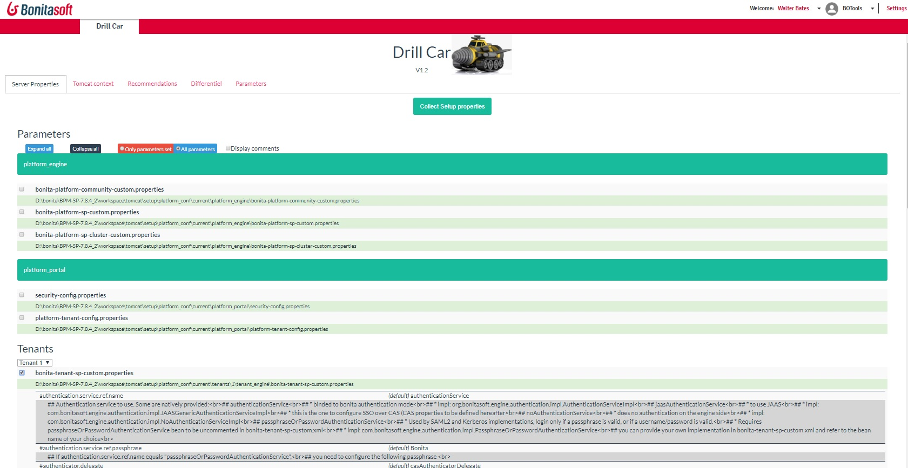

page_drillcar

Drill page collect all parameters from the Bonita Server, and offer a simple interface to access it.
It offer the Recommendation tools, to verify your configuration, and returns some advice
The Comparaison tool detect changes on the platform from factory

<h1>Access parameters</h1>

Access all the Bonita parameter. Page do a “setup pull” to collect the last configuration, then display it properties per properties.
 

<h1>Access Server configuration</h1>
Access the Tomcat main parameters files : datasource definition,
 
<h1>Recommendations</h1>
The page check your platform from a serie of recommendation. It show you the  different setup you should update to have a efficient platform

 	 
<h1>Comparison</h1>	 
Compare your platform from a factory installation

